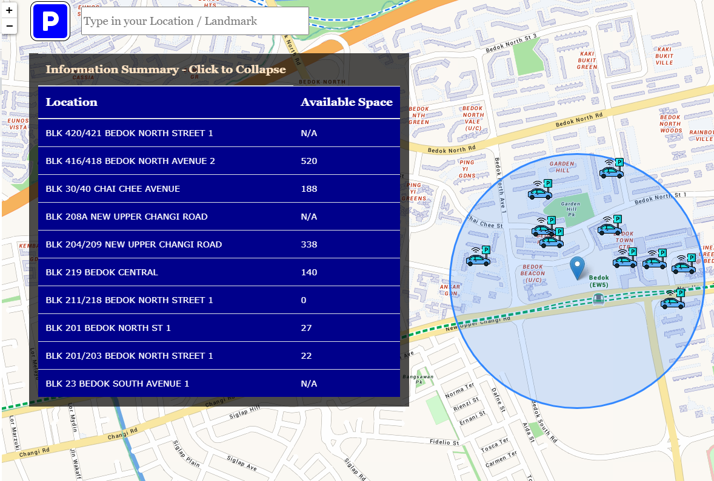
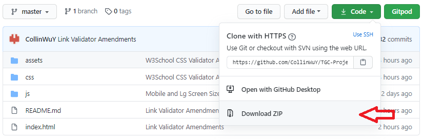
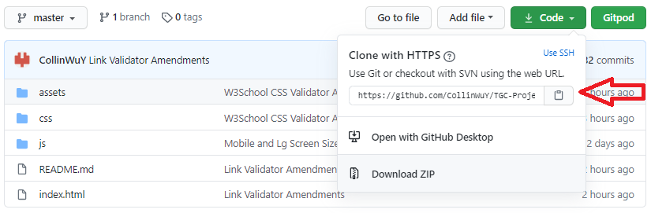

# Where to Park? #

### TGC - Interactive Development Milestone Project 2 ###
By: **Collin Wu Yuewei** -- *Code Institute Batch 8* -- 

An interactive website meant to help local Singaporean's to find alternative carparking in HDB areas when their destination is full-up. Singapore is a tightly dense metropolitan city, where many drive to highly dense congregation locations like malls, hotels, cinemas, offices... etc. 

Many of times, these places face full carpark queue lines, and people may even wait up to an hour before finding carpark at such location. Luckily in Singapore, there are many residential Housing Developement Board (HDB) carparks close-by these areas that area easily accessible, automated with gantries and slots tracking, though it requries a short-walk to the location. This website aims to helps you find these carparks and inform you the available slots left within a 500m zone.

## Aim ##
The goal of the project is to build an interactive site to present useful information drawn from different sources to the user, using techonology and languages taught in the Code Institute Fullstack Web Developer Program; at Project 2, namely HTML, CSS and JS.

The concept chosen for this project is to find a solution to a daily common problem of having to face carpark queue lines when heading towards malls or areas of interest. The problem is people do not know the locations and availability of residential carparks around their destination and decide to park at the location instead. The easy and efficient solution is closely around, and this website's aim is to provide these information for users to make decisions instead of blindly queueing up for hours.

## Demo ##

The full website demo can be previewed here: [Where to Park?](https://collinwuy.github.io/TGC-Project2/)

Responsive is tested using Google Inspector:  

 

## UX ##

The target audience for this website are for people who are drivers that are on the move. Whom are going to packed locations such as malls, events...etc or are stuck in carpark queues.  

The website concept is mainly to be a clean and simple interface, where the only actions are either text-box, icons or buttons. Removing the "barrier to learn", allowing any new user to pick-up and use immediately.

This project was a mobile first and a single hand operation design in mind. It has to fill the screen and have sufficiently large fonts for pleasant viewing and accessiblity. A big striking blue Call-To-Action button right in the middle of the screen that accesses the GPS capability of modern day high-tech phones. Allowing pin-point accuracy to the current location.

Obvious blue car icons are dotted on the map as locations of carparks in the zone and have pop-ups to give essential information to the user. The available carpark is the largest of the information and is color coded depending of the current availability parking slots in relations to the total slots available at the carpark.

By hiding pages and only display the relevant page at 100% viewport, no scrolling is required to gain full access to information.

A secondary text-box search is located below the Call-To-Action button on the homepage and top-left beside the return to homepage icon on the map page to allow destination planning, re-locating the center of scanning or when GPS locator is unavailable.

On larger devices, more fanciful click-to-expand location summary table is available to view all locations in the zone and their available carpark slots at a go.
 

## Features ##
- Full 100% Viewport per page to focus the user's attention
   
- Single Website, All Pages Design for minimal loading of links or other pages 
   
- 3-5sec Loading Page for allowing all API data retrievial to be completed preventing interruptions on usage
   
- Loading page will store a reload value into localstorage, that then stops the refreshing webpage of setTimout on the second load 
   
- Quick Access Call-to-Action button that use GPS/Geolocation to determine location
   
- Color-coded information for better UX
   
- Loading Page (_Page0_)
  - Animated circle movements to indicate loading of the webpage and intuitively let the user know to let it load for a few seconds
  - Loads faster the first time accessing and hides on loaded
   
- Homepage  (_Page1_)
  - Striking blue Call to Action Button
  - Secondary Text-box option as backup if GPS/Geolocation not available or for pre-planning destination
  - Hides on either GPS or Text-box search call to give precendence to map page
   
- Interactive Map (_Page2_)
  - Local Singapore Map with Detailed road names, locations and points of interest
  - A 500m blue circle zone to limit search, allowing focusing of user experience to the most important information around them. (_No one wants to walk 1km to their location if carpark is too far_)
  - Cute blur car icons with informative pop-ups for cleaner viewing
  - Color-coded percentage parking slots to emphasize on urgency to get parking
  - Quick summary table for larger screens for all carparks in the zone
  - Quick Search Text-box for location change and return to Homepage Icon on top-left 
   

### Features Left to Implement ###

- More information from different API sources, example: Parking Cost/hr, Mall/Event parking capacity, etc...
- More robust data retrieval, to encompass all carparks available on top of current HDB carparks
- GPS guiding system to plan routes to chosen carpark
- ADs system for monetization, allowing future growth
- Convert to Android or iOS, making it an App (modern)

## Technologies Used ##

* [HTML](https://www.w3schools.com/html/ "HTML Info Page")
    - HTML is universal base language for creating webpages compatible with majority browsers

* [CSS](https://www.w3schools.com/css/ "CSS Info Page")
    - CSS is used for implementing styling to a webpage 

* [JavaScript](https://www.w3schools.com/js/ "JavaScript ES6 Info Page")
    - JavaScript is the programming language of HTML and the Web
    - Used for API data retrieval
    - Button interactions
    - Color background changes
    - Sort gathered information and creation of JSON for data collected for unified access
* [Leaflet JS](https://leafletjs.com/ "Leaflet JS Maps Homepage")
    - Interactive Maps with Pop-up and Markers
    - Boundary setting for precise data display
* [oneMap API](https://www.onemap.sg/home/ "oneMap Homepage")
    - Singapore Local Information with detailed Map of roads, places of interest, rails, malls
    - Consolidated information on carpark location and details
* [Data Gov SG](https://data.gov.sg/ "DataGovSG databases Homepage")
    - Singapore's Open source database with frequently updated information
    - Availabiliy of Carparks slots tracking due to automated gantry carparks
* [Git](https://git-scm.com/ "Installation for Git Support")/[Github](https://github.com/ "Github Homepage")
    - For version control and commits to Github
* [VSCode IDE](https://code.visualstudio.com/ "VSCode IDE Homepage")
    - Local IDE for coding HTML/CSS/JavaScript
    - Extensions used:
      - HTML CSS Support
      - HTML CSS Snippets
      - IntelliSense for CSS
      - JS-CSS-HTML Formatter
      - Live Server (Preview)
      - BootStrap 4, FontAwesome 5 Free
      - Markdown All in One
      - Mardown Preview Enhanced
      - Prettier - Code Formatter

## Testing ##

#### Responsiveness ####
The webpage was manual tested for responsiveness on physical iPhone 6S, Samsung S8+, Xiaomi Mi Max2, 1920 x 1080 laptop screen.

Due to the unavailability of localstorage on reponsiveness testing webpages like  [Responsiveness Tool](http://responsivetesttool.com/ "Responsiveness Tool Homepage")  or  [Mobile-Friendly Test](https://search.google.com/test/mobile-friendly?id=07L3WeU_nndVYwaUTleP7w "Mobile Friendly Test Homepage")  or [Am I Responsive Design](http://ami.responsivedesign.is/ "Am I Responsive Design Homepage"), I was unable to show responsiveness without disabling the loading page. Therefore the best way fo testing responsiveness was with Google Inspector as shown at the Demo section above.

All platforms had to have correct CSS design, working animation, buttons, pop-up and elements placed in the correct position.

#### Page Load Time ####

The page load time is tested using [Pingdom Tool](https://tools.pingdom.com/) while being hosted by GitHub Pages. This is vital and important as the goal was to have a responsive, non-laggy webpage with no link-loading from page to page, achieving an __A__ rating of __91/100__ points also on Asia, America and European Servers.

#### Code Validation ####

Code validation is achieve by using developer tools provided by [W3C Developer Tools](https://w3c.github.io/developers/tools/ "W3C Developer Tools Webpage"). The webpage code tested til no errors are found on their [Nu Html Validator](https://validator.w3.org/nu/?doc=https%3A%2F%2Fcollinwuy.github.io%2FTGC-Project-1%2F), [Internationlization Validator](https://validator.w3.org/i18n-checker/check?uri=https%3A%2F%2Fcollinwuy.github.io%2FTGC-Project-1%2F#validate-by-uri+), [CSS Validator](https://jigsaw.w3.org/css-validator/validator?uri=https%3A%2F%2Fcollinwuy.github.io%2FTGC-Project-1%2F&profile=css3svg&usermedium=all&warning=1&vextwarning=&lang=en), [Link Validator](https://validator.w3.org/checklink?uri=https%3A%2F%2Fcollinwuy.github.io%2FTGC-Project-1%2F&summary=on&hide_type=all&depth=&check=Check).

#### Manual Testing ####

Other testing include:
- Testing of button a tag links, ensuring they jump to the correct part of the page
- Hover animation testing with laptop and mouse overs
- Accordion testing, ensuring pop-up panel happens on click
- Social button's linking to Call on mobile, new page for facebook and re-direct to email with email button
- Contact form testing
  - Error pop-up alert for not having required fields
  - Email format is correct before able to submit
  - Ensuring JavaScript is active, allowing only 1 checkbox to be selected at a time
  - Proper Error Pop-up if form validation has an error
  - Proper Success Pop-up if form submit and validation is successful

#### Browser Testing ####

The site while being hosted by Github Pages is tested on a laptop of 1920x1080 resolution:
- Brave
- Google Chrome
- Firefox
- Microsoft Edge

It is also tested on a iPhone 6S for:
- Safari 

#### Bugs ####

Currently as the mobile responsiveness is accomplished by purely CSS, different vertically of different device viewports causes shifting of the format of the webpage, or having the fonts becoming too small for that viewport. I think this can be resolve if the html is convertered into BootStrap for more unified resizing as compared to media queries.

On certain browsers, like Safari, JavaScript may not function on old versions of Safari and Firefox Browsers have issue reading CSS for checkboxes. However based on [W3School Browser Statics](https://www.w3schools.com/browsers/) in 2020, 80%+ uses Chrome, small number of people uses other browsers.

## Deployment ##

This project uses Git for version control and hosts the repository for all commits. It is linked to my local VSCode IDE. The depolyed site is hosted by Github Pages where it can automatically updated on new commits.

This project can be accessed via [CollinWuY's Github](https://github.com/CollinWuY/TGC-Project-1) where you can clone/download to your computer directly, or immedaitely view the code. 

All the needed assets, images, videos, fonts, icons, javascript, css are in their respective folders, the main site is named index.html, all of which are offline, only links to socials are online.

#### Downloading Locally ####

All files can be easily download on the Github site:
1.  At the top right, click on green button under __CODE__
2.  Select last option: Download .zip

3.  Download the .zip file that can be opened with a ZIP unpacker or RAR unpacker 
4.  Unzip the package
5.  Double click the index.html
    -   it should open on your preferred browser.

#### Linking to Local IDE ####

Cloning this repository can be achieve by using the link provided at the Github site:
1. At the top right, click on green button under __CODE__
2. Copy the link provided: `https://github.com/CollinWuY/TGC-Project-1.git`

3. In your preferred IDE, Run in terminal `git clone https://github.com/CollinWuY/TGC-Project-1.git`
4. Repository will be cloned as a folder on your computer

## Credits ##

#### Media ####

- Background Video and Therapist Images are all Personal Images
- Moshe Feldenkrais Image is taken from [Wikipedia-Moshe Feldenkrais](https://en.wikipedia.org/wiki/Mosh%C3%A9_Feldenkrais)

#### Icons ####

- All icons are downloaded as SVG from [Font Awesome](https://fontawesome.com/)
- Browser Tab Icon is Logo convertered using [Favicon.io](https://favicon.io/favicon-converter/)

#### Code/Concept ####

- Responsive Side Navbar is a modified version of [CodingNepal - Responsive Sidebar Menu using HTML & CSS](https://www.codingnepalweb.com/2020/04/responsive-sidebar-menu-html-css.html)  
- Call to Action button on Homepage is a modified version of [Online Tutorials - Neon Light Animation Effects on Hover | CSS Snake Border](https://www.youtube.com/watch?v=ex7jGbyFgpA)
- Page 3 - Accordion buttons are modified version of Accordion from [W3Schools.com](https://www.w3schools.com/howto/howto_js_accordion.asp)
- Color Palette is generated by [Coolors.co](https://coolors.co/282c34-542331-fa7d64-ffe1a8)
- Pop-up alerts library is downloaded from [Sweet Alert 2](https://sweetalert2.github.io/)

#### Fonts ####

- Fonts are downloaded at [Google Fonts Mallanna](https://fonts.google.com/specimen/Mallanna?query=mallanna) | [Google Fonts Montserrat](https://fonts.google.com/specimen/Montserrat?query=montserra)

#### Unused Libraries for Future Implement ####

- [BootStrap 4.5 CSS and JS](https://getbootstrap.com/docs/4.5/getting-started/download/) 
- [jQuery 3.5.1 JS](https://jquery.com/download/)
- [Popper.js.org](https://cdn.jsdelivr.net/npm/popper.js@1.16.0/dist/umd/popper.min.js)
 

__THIS WEBSITE IS FOR EDUCATIONAL PURPOSE ONLY - ALL RIGHTS RETAIN BY COLLIN WU YUEWEI__